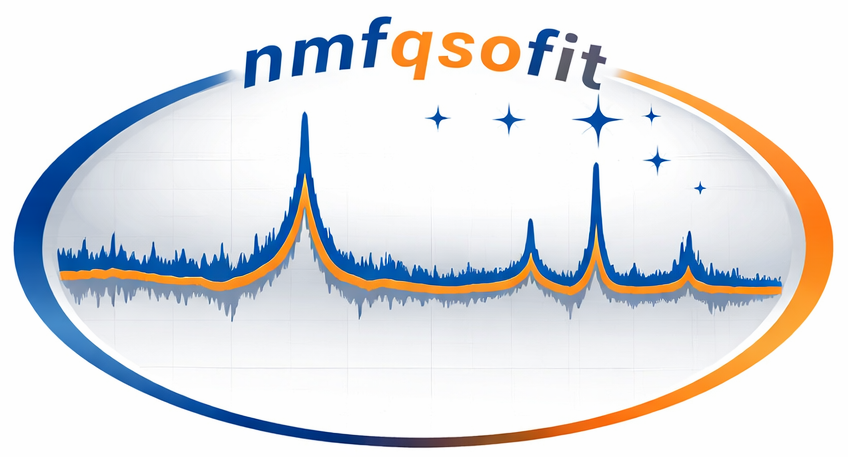

<div align="center">
    
</div>

<br>

<div align="center">


[](https://github.com/abhi0395/nmfqsofit)
[](https://github.com/abhi0395/nmfeigenspectra)
[](https://arxiv.org/abs/2103.15842)
[](https://arxiv.org/abs/1612.06037)
[](https://codecov.io/gh/abhi0395/nmfqsofit)
[](https://github.com/abhi0395/nmfqsofit/blob/main/LICENSE)

</div>

nmfqsofit: Quasar Continuum Fitter
============

`nmfqsofit` is a Python package for estimating quasar continua using precomputed Nonnegative matrix factorization (NMF) eigenspectra. It supports both Nonnegative least square (NNLS) and NMF coefficient fitting. It is generic enough to work with any kind of spectra. Though it has been currently only tested on large spectroscopic surveys like SDSS and DESI. It is well designed for both local and HPC environments.

---

## Features

- **NMF-based quasar continuum modeling** – Fits coefficients using Nonnegative Matrix Factorization (slower)
- **NNLS alternative** – Optionally use Nonnegative Least Squares for coefficient fitting (faster)
- **Iterative absorption rejection** – During coefficient fitting, pixels with low flux (absorption troughs) are iteratively sigma-clipped so they do not pull the continuum downward
- **Spectrum normalization & scaling** – Fits the normalized spectrum and automatically scales the continuum back to the observed frame  
- **Flexible eigenvector interpolation** – Interpolates NMF eigenvectors to observed frame using user-provided interpolation kind (e.g., 'linear', 'cubic', 'nearest')  
- **Multiple redshift-dependent eigenspectra support** – Handles multiple redshift bins with automatic selection based on quasar redshift  
- **Automatic best-eigenset selection** – When multiple redshift bins overlap, selects the eigenset whose rest-frame wavelength range has the most valid observed pixels (maximum spectral coverage), rather than using chi2 which can be biased by absorption  
- **Median filtering correction** – Applies iterative median-filter smoothing to the continuum to remove small and intermediate-scale calibration residuals  
- **Efficient parallel processing** – Multiprocessing-based batch fitting optimized for HPC environments  
- **Flexible eigenspectra loading** – Load from single FITS files or entire directories  
- **Clean FITS I/O** – Out of the box functions for input/output files with validated HDU structure  
- **Unit tests included** – pytest-based test suite with integration tests 
- **Logging** – All operations are logged with timestamps, function names, and line numbers.

---

## Designed For

- Large spectroscopic surveys (SDSS, DESI, MUSE, 4MOST, WEAVE, WAVES, HST etc.)
- Local system or HPC slurm based jobs
 
----


## Requirements

- Python >= 3.9
- numpy
- scipy
- astropy
- matplotlib
- psutil
- tqdm
- pyyaml
- NonnegMFPy (Zhu 2016 NMF implementation) ([see here](https://github.com/guangtunbenzhu/NonnegMFPy))

Install dependencies manually if needed:

```bash
pip install numpy scipy astropy matplotlib psutil pytest NonnegMFPy tqdm pyyaml
```

---

## Installation

Clone the repository:

```bash
git clone https://github.com/abhi0395/nmfqsofit.git
cd nmfqsofit

# Install a tagged version (stable and reproducible). Replace vX.Y.Z with the desired Git tag (for example v1.0.0).
pip install --upgrade "git+https://github.com/abhi0395/nmfqsofit.git@vX.Y.Z"

#Install in editable mode (for developers):
pip install -e .
```

## Run Unit tests and verify installation

```bash
python -m unittest discover -s tests
nmfqsofit --help
```

---

## NMF Eigenspectra (Necessary before you run the script)

The NMF eigenspectra are maintained in a separate [repository](https://github.com/abhi0395/nmfeigenspectra). This keeps the eigenspectra data independent from the `nmfqsofit` codebase, allowing both to evolve separately. Currently, the repository provides eigenspectra built from **SDSS DR14** and **DESI DR1** quasar spectra only. In the future, eigenspectra from additional surveys (e.g., 4MOST, WEAVE, HST, WAVES) will be added.

Before running `nmfqsofit`, download the eigenspectra repository. It is recommended to use **tagged** version to ensure reproducibility. 

```bash
git clone https://github.com/abhi0395/nmfeigenspectra.git

### For SDSS DR14 eigenspectra, use the sdss/ directory:
/path/to/nmfeigenspectra/sdss/

### For DESI DR1 eigenspectra, use the desi/ directory:
/path/to/nmfeigenspectra/desi/
```

### Eigenspectra Loading

The `--eigenspectra` argument can point to either:
- A **directory** containing multiple eigenspectra FITS files – automatically loads all files matching the naming pattern
- A **single FITS file** – loads eigenspectra directly from that file

The pipeline automatically:
- Selects appropriate eigenspectra based on quasar redshift  
- Fits using all matching redshift bins  
- Use either NMF or NNLS method to find continuum coefficients
- Performs efficient smoothing to improve reduced chi2
- Chooses the solution with maximum spectral coverage (valid pixel count within the eigenset's rest-frame range) 
- Logs detailed information about loaded eigenspectra (redshift bins, wavelength ranges, number of components)
---

##  How It Works

1. **Load quasar spectra** – Reads FLUX, IVAR, WAVELENGTH, and METADATA (with redshift Z) from FITS files.
2. **Load eigenspectra** – Loads NMF eigenspectra from a directory or single file. Eigenspectra are organized by redshift bins and wavelength ranges.
3. **For each quasar**:
   - **Identify matching redshift bins** – Selects eigenspectra with redshift bins encompassing the quasar's redshift.
   - **Normalize spectrum** – Normalizes the observed spectrum to a reference continuum level using header keywords in eigenspectra.
   - **Interpolate eigenvectors** – Interpolates eigenspectra from eigenspectra wavelength grid to observed wavelength grid using user-specified interpolation kind (linear, cubic, etc.).
   - **Fit coefficients** – Solves for NMF/NNLS coefficients on the normalized spectrum using `scipy.optimize.nnls` or `NonnegMFPy`. Pixels with low flux relative to the model (absorption troughs) are iteratively sigma-clipped so they cannot bias the fit downward. The sigma threshold is estimated from emission-side residuals only.
   - **Scale back to observed frame** – Reconstructs the continuum in observed frame using the fitted coefficients and interpolated eigenvectors.
   - **Select best eigenset** – If multiple redshift bins are valid, selects the eigenset whose rest-frame wavelength range covers the most valid observed pixels. This is more robust than chi2-based selection, which is biased downward when absorption features are present (a continuum that traces absorbers has artificially low chi2). The coverage criterion directly reflects how well the data constrain the coefficients.
4. **Apply median filtering correction** – Applies median-filter smoothing correction in the observed frame to remove intermediate and small-scale calibration residuals. Absorption dips are pre-masked via MAD sigma-clip before the iterative smoothing loop, preventing them from entering the filter. The smoothed continuum is kept only if it reduces the chi2 over all pixels; otherwise the original continuum is retained.
5. **Save results** – Writes coefficients, continuum, fit statistics, and metadata to the output FITS file.
6. **Logging** – All operations are logged with timestamps, function names, and line numbers.


---

Input FITS Structure
------------

The input FITS file must have the following structure:

| HDU | Description |
|------|------------|
| Primary | Headers only |
| FLUX | Observed flux |
| IVAR | Observed ivar (inverse-variance) |
| WAVELENGTH | observed wavelength |
| METADATA | Spectra metadata, must contain redshift of Quasars with key **Z** |

---

## Command Line Usage

### Basic Run (using example sdss data)

```bash
nmfqsofit \
  --spectra-file data/test_sdss_spectra.fits \
  --eigenspectra /path/to/nmfeigenspectra/sdss \
  --kernel-size 141 \
  --kernel-small 71 \
  --method nnls \
  --interp-kind linear \
  --ncpus 8 \
  --output continuum.fits \
  --headers AUTHOR=Abhijeet SURVEY=SDSS VERSION=1.0 \
  --n-qso 3
```

### Running with a configuration file

```bash
nmfqsofit --config config_example.yml
## config.yml file will contain all the user-defined arguments to run the script
```

> **Important — override precedence:** when `--config` is provided, **every key in the YAML file overwrites the corresponding CLI argument**, including values you explicitly passed on the command line. CLI arguments only take effect for keys that are *absent* from the config file. To mix both, omit a key from the YAML and pass it on the command line instead.

See `config_example.yml` file to see how a parameter config file will look like.


### Options

| CLI argument | Required / Optional | Description |
|---|---|---|
| `--config` | Optional | Path to a YAML config file; values override all other CLI arguments |
| `--spectra-file` | Required | Input FITS file with FLUX, IVAR, WAVELENGTH, and METADATA (with Z column) |
| `--eigenspectra` | Required | Directory or single FITS file containing NMF eigenspectra |
| `--output` | Required | Output FITS filename |
| `--method` | Optional | Fitting method: `nnls` (Non-Negative Least Squares) or `nmf` (Non-negative Matrix Factorization); default: `nnls` |
| `--interp-kind` | Optional | Eigenvector interpolation method (`linear`, `cubic`, `quadratic`, etc.); default: `linear` |
| `--kernel-large` | Optional | Median filter kernel size for intermediate-scale smoothing correction (odd integer); default: `141` |
| `--kernel-small` | Optional | Median filter kernel size for small-scale smoothing correction (odd integer); default: half of `--kernel-large` rounded up to the nearest odd integer |
| `--ncpus` | Optional | Number of CPU processes for parallel fitting; default: `4` |
| `--maxiters` | Optional | Maximum iterations for NMF or NNLS solver; default: `200` |
| `--smoothing-niter` | Optional | Maximum iterations for median filtering; default: `3` |
| `--fit-niter` | Optional | Number of iterative sigma-rejection passes during coefficient fitting; default: `3` (set to `0` to disable) |
| `--fit-nsigma` | Optional | Downward sigma threshold for absorption rejection during coefficient fitting; default: `3.0` |
| `--smooth-nsigma` | Optional | Downward sigma threshold for absorption masking during smoothing correction; default: `3.0` |
| `--n-qso` | Optional | Number of QSOs to process – integer (`100`), range (`1-1000`), or stepped range (`1-1000:10`) |
| `--headers` | Optional | Extra FITS header keywords to write (e.g., `AUTHOR=Name SURVEY=Survey`) |

### Using NMF (instead of NNLS)
Replace `--method nnls` with `--method nmf`.

Output FITS Structure
------------

The output FITS file contains:

| HDU | Description |
|------|------------|
| Primary | Headers only |
| COEFFICIENTS | NMF or NNLS coefficients (nspec x ncomp), can be used to construct first continuum |
| FIRST_CONTINUUM | First reconstructed continuum (before median filtering) |
| CONTINUUM | Final median-filter corrected continuum |
| METADATA | Z, FIRST_COST, FINAL_COST, EIGVECTOR_RANGE, ZMIN, ZMAX, NORM_FACTOR, N_COMP, SUCCESS |

---

Plotting Example
------------

```python
from nmfqsofit.io import QSOSpecRead, ContinuumSpec
from nmfqsofit.utils import plot_flux_and_continuum

# Read QSO spectra (FLUX, IVAR, WAVELENGTH, METADATA)
spec = QSOSpecRead("/path/to/your/spectra.fits", autoload=True)

# Read nmfqsofit continuum output (COEFFICIENTS, FIRST_CONTINUUM, CONTINUUM, METADATA)
nmfmodel = ContinuumSpec("/path/to/your/continuum.fits", autoload=True)

# Plot flux and continuum for the first QSO
ax = plot_flux_and_continuum(
    spec.wavelength,           # observed wavelength array  (nwave,)
    spec.flux[0, :],           # flux of the 1st QSO        (nwave,)
    nmfmodel.continuum[0, :],  # NMF continuum of 1st QSO   (nwave,)
    title=f"QSO  z = {nmfmodel.metadata['Z'][0]:.3f}",
    flux_kwargs={"color": "black", "lw": 1, "alpha": 0.8},
    continuum_kwargs={"color": "red", "lw": 2},
    ax_kwargs={"xlim": (3600, 10000)},
)
```

---

Useful notes:
-------------

Parallel mode can be memory-intensive if the input FITS file is large in size. As the code accesses the FITS file to read QSO spectra when running in parallel, it can become a bottleneck for memory, and the code may fail. Currently, I suggest the following:

- **Divide your file into smaller chunks:** Split the FITS file into several smaller files, each containing approximately `N` spectra. Then run the code on these smaller files.

- **Use a rule of thumb for file size:** Ensure that the size of each individual file is no larger than `total_memory/ncpu` of your node or system. Based on this idea you can decide your `N`. I would suggest `N = 1000-2000`.

In order to decide the right size of the FITS file, consider the total available memory and the number of CPUs in your system.

---

Citations
------------

If you use this code, please cite:

- [Anand et al. (in prep](https://github.com/abhi0395/nmfqsofit)), Full Description of **nmfqsofit** and DESI DR1 eigenspectra and continuum
- [Anand et al. 2021](https://arxiv.org/abs/2103.15842), First development of **nmfqsofit** and SDSS DR14 eigenspectra and continuum 
- [Zhu 2016](https://arxiv.org/abs/1612.06037), Vectorized NMF implementation

---

Contribution
------------

Contributions are welcome! Please submit a pull request or open an issue to discuss your ideas.

Acknowledgements
-----------

The first crude version of the code was developed and written by me during my PhD with lots of suggestions from my PhD supervisors [Prof. Dr. Guinevere Kauffmann](https://www.mpa-garching.mpg.de/person/44092) and [Dr. Dylan Nelson](https://nelson.tng-project.org/). Over the years, it has evolved from a specialized script into the generic, community-ready framework it is today. I would like to extend my thanks to the VS Code AI agents, which were instrumental in refining the codebase. They provided invaluable assistance in documenting functions, logging details, optimizing logic, and expanding unit test coverage, helping to ensure the code is both robust and maintainable. The project logo was created from a continuum example generated by me using ChatGPT.

License
-------

Copyright (c) 2021-2026 Abhijeet Anand.

**nmfqsofit** is a free software made available under the MIT License. For details, see the LICENSE file.

Thanks,  
Abhijeet Anand  
IUCAA, Pune &
Lawrence Berkeley National Lab
